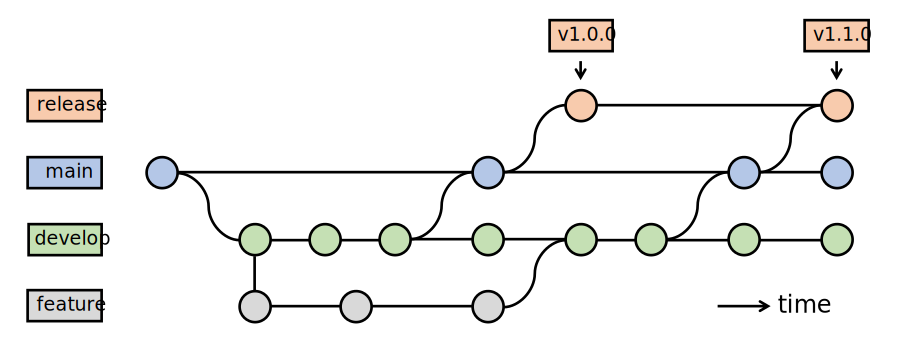

# Development process of the Accellera UVM-SystemC library

This document focuses on the technical aspects related to the development
of the UVM-SystemC library.  Legal and formal procedures are documented at 
<https://accellera.org/about/policies-and-procedures>

## Repository setup

The central source code repository of the UVM-SystemC  
library is hosted at [GitHub](https://github.com/accellera-official/uvm-systemc).
The read-only repository can be found at

 * <https://github.com/accellera-official/uvm-systemc>

### Creating a personal fork

In order to contribute changes to the repository, it is recommended to create
personal (or company-based) [forks][2] of the repository on GitHub and push 
the proposed changes (bugfixes, features, ...) there.  Details of the intended
work-flow are described in the next [section](#basic-branch-setup).  It is 
convenient to add this GitHub fork as a remote to your local clone of the 
repository:

```
cd <repo>/
git remote add origin git@github.com:<your-account>/<repo>.git
git branch --set-upstream main origin/main
```

Contributions to the Accellera UVM-SystemC library should comply with the
[contributing guidelines][1].  Any changes can then be pushed to GitHub using:

```
git commit --signoff
git push [options] [<repository>] [<refspec>...]
```

 * If you omit the `<repository>`, the default destination is
   the remote of the current branch (or `origin`).
 * The `<refspec>` basically follows the format
    `<local-branch>:<remote-branch>`, or just `<branch>`, if
   both are the same.
 * Omitting the `<refspec>` pushes all branches with 'matching'
   remote branches to the repository.

A basic cheat sheet containing the an overview of the general
Git commands and workflow can be found [online][3].

## Development flow

This section explains the development flow for this repository.

### Basic branch setup

The following branches exist in a UVM-SystemC repository:

* **main**

  The latest and greatest `HEAD` of the UVM-SystemC development.
  This is where all finalized and approved features and fixes go.

* **develop**

  This branch is used for development and testing of enhancements,
  new features and fixes which are not yet finalized and approved.

* **release**

  This branch is used to create the release tarballs, both internal
  and public snapshots, typically based on the `main` branch.

In addition, these repositories may contain additional branches for dedicated
feature developments, but it is expected that these branches are merged into
the `main` or `develop` branch.

For the **regressions**, the `release` branch is more or less just a pointer
to the latest revision of a snapshot (or release).  It is still useful
to keep a named branching point, in case of required hotfixes.

The `release` branch is different from the
`main` branch.  The idea is to fully track the contents of the released
tarball.  This requires the following changes compared to the `main`
branch:

  - The Automake generated files are added to this tree.
  - Accellera internal files are stripped
    (`.gitignore`, internal documentation, ...).

To prepare a release, the `main` branch would then be merged into the
`release` branch, the Automake files would be updated (if necessary) and
the clean working tree could be used as baseline for the tarball (e.g.,
via `git-archive(1)`).  Details are described in the next section
[release management](#release-management).  The history of the
repository could then look like shown in the following graph
(time progresses upwards):



If more sophisticated version branches are needed, a development
model similar to the well-known ["successful branching model"][12]
can be deployed.  Not all aspects of this model are expected to
be needed for the SystemC implementation, as we usually
maintain only a single (i.e., the latest) public release of the
kernel.

### Adding a feature (set)

The development of a new contribution in form of a feature or a
complex bug fix is best done in a new feature branch, which is
forked and checked out from the `develop` branch:

```
git checkout -b <company>-<feature-xyz> develop
```

Then code up the new contribution.  Please try to facilitate code
review by other Accellera members by logically grouping your changes into
one commit per addressed issue. For the commit messages, please
consider to follow these suggestions: 

>  *Note:* **Commit messages**
>
>  Though not required, it's a good idea to begin the commit message with
>  a single short (less than 50 character) line summarizing the change,
>  followed by a blank line and then a more thorough description.  Tools
>  that turn commits into email, for example, use the first line on the
>  `Subject:` line and the rest of the commit in the body.

> *Note:* **Sign-off procedure for commits**
>
> In order to document that contributions are submitted under the
> Apache-2.0 license (see [LICENSE](../LICENSE)), a sign-off procedure is
> defined in the [contributing guidelines][1].

During the development of the contribution, the `develop` branch may
receive other commits.  In that case, consider rebasing the commits in
your feature branch onto the `HEAD` of the `develop` branch to keep the
history clean.  Once the contribution is ready for review by the
working group, push the feature branch in your fork of the respective
repository on GitHub:

```
git push <your-github-fork-remote-name> <company>-<feature-xyz>
```

Then, send a [pull request][5] either manually or via [GitHub][5] to
initiate the code review by the Accellera working group members.  The
summary can be manually generated by

```
git request-pull develop git@github.com/<account>/<repo>.git \
   <company-feature-xyz>
```

to be sent to the Accellera Verification Working Group email reflector.

To review the proposed contributions, one can either browse the
repository at GitHub, or add the remote location to a local
clone of the repository

```
# add the fork to your set of "remotes"
git remote add <remote-name> git@github.com/<account>/<repo>.git
git fetch  <remote-name>

# examine differences
git diff develop..<remote-name>/<company-feature-xyz>
git log <remote-name>/<company-feature-xyz>
```

After the contribution is accepted, it will be merged into the
`develop` branch by the responsible source code maintainer.  This should
be done with an explicit *merge commit*, to keep the individual 
contributions separated:

```
git merge --no-ff --log \
   <remote-name>/<company-feature-xyz>
```

Instead of fully merging the contribution, the maintainer may choose
to cherry-pick individual commits or to rebase the feature branch on
an intermittently updated `develop`.  He may also request additional
changes to be done by the submitter.  In that case, the submitter may
need to merge recent changes to the `develop` branch into his feature
branch before carrying out the requested changes.

After the contribution has been fully merged into `develop`, the
feature branch in the local and Github fork may be deleted.

```
git branch -d <company-feature-xyz>      # delete local branch
git push  origin :<company-feature-xyz>  # delete remote branch
```

### Maintaining a private (set of) branches

Vendors may be interested in maintaining their own, in-house flow
to align the internal development of a derived implementation, 
while being able to pick fixes from other trees, and (hopefully) 
contributing fixes and features back to this library.

For this purpose members may employ the already mentioned ["successful
branching model"][4] by Vincent Driessen.  The vendor can branch its
own development branch, e.g., `develop-<vendor>` from the already
tracked development branch `develop` in his clone of the
repository. The vendor is then able to integrate commits on the
development branch by merging it into his his vendor development
branch.

Bug fixes to be contributed back to the repository consist usually of one or
several isolated commits.  They need to be cherry-picked from the
vendor's development branch into a new branch created from the repository
development branch:

```
git checkout -b <vendor>-fix-<bug> origin/develop
git cherry-pick <commit>...
```

Once, the bug fix branch is ready, it should be pushed into the
vendor's github account and a pull request created, as described in
the [feature branch section](#adding-a-feature-set).

A new feature consists usually of a series of commits developed in a
dedicated feature branch of the vendor's or in the repository development
branch.  Only in the first case, a rebase on the top of the repository
development branch is necessary.  To this end, branch first from the
feature branch:

```
git checkout -b <vendor>-<new-feature> <private-feature-branch>
git rebase [-i|--interactive] --onto origin/develop develop-<vendor>
```

Once, the bug fix branch is ready, it should be pushed into the
vendor's github account and a pull request created, as described in
the [feature branch section](#adding-a-feature-set).


## Issue tracking

Open issues (bugs, cleanups, features) are tracked via GitHub:

 * <https://github.com/accellera-official/uvm-systemc/issues>

> *NOTE:* For issues discussed in the SystemC Verification Working Group,
          an internal issue tracker is preferred.


[1]: ../CONTRIBUTING.md "Contributing to the UVM-SystemC library"
[2]: https://docs.github.com/en/get-started/quickstart/fork-a-repo
[3]: https://zrusin.blogspot.de/2007/09/git-cheat-sheet.html "Git Cheat Sheet"
[4]: https://nvie.com/posts/a-successful-git-branching-model/ "'A successful Git branching model' by Vincent Driessen"
[5]: https://help.github.com/articles/using-pull-requests "Using Pull Requests - github:help"

